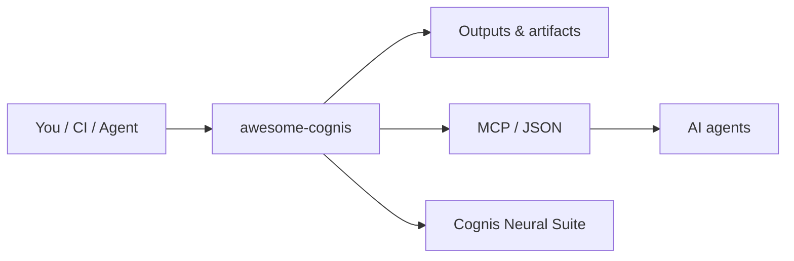

# Awesome Cognis [](https://awesome.re)

> A curated list of the **Cognis Neural Suite** and the open-source projects it builds on.

All tools are single-purpose, self-hostable, and MCP-native. [Cognis Digital](https://cognis.digital) · [umbrella](https://github.com/cognis-digital/cognis-neural-suite)

## Usage — step by step

This is an Awesome list (curated catalog) — there is no install; you consume it as a directory of the Cognis Neural Suite.

1. **Open the list** in this README and jump via the [Contents](#contents) to a category (AI Security & Governance, AI Agents & LLMOps, Blue/Red Team, OSINT, Federal & Compliance, ...).
2. **Pick a tool** entry and follow its link to the tool's own repo, where the per-tool Usage walkthrough and install command live.
3. **Install the tool you chose** from its repo, e.g. a suite CLI:
   ```bash
   pip install cognis-mcpharden    # example — see the chosen tool's README for its real package
   ```
4. **Discover related tools** in the same category to compose a pipeline (e.g. map -> audit -> harden across AI Security entries).
5. **Contribute / keep current in CI** — fork, add your entry following the existing format, and open a PR. See [`CONTRIBUTING.md`](CONTRIBUTING.md) and the [Built on](#built-on) section for prior-art lists this draws from.

## Contents

- [🛡️ AI Security & Governance](#ai-security)
- [🤖 AI Agents & LLMOps](#ai-agent)
- [🔵 Blue Team](#blue-team)
- [⚔️ Red Team](#red-team)
- [🔍 OSINT](#osint)
- [🏛️ Federal & Compliance](#federal)
- [🕵️ Privacy](#privacy)
- [📡 Network](#network)
- [📰 Information Integrity](#info-integrity)
- [🔗 Supply Chain](#dev-supply-chain)
- [🧰 Developer Tools](#devtools)
- [🗄️ Data & Datasets](#data)
- [📋 Compliance & GRC](#compliance)
- [💼 Business Ops](#business)
- [📈 DevOps & Observability](#ops)
- [Built on (upstream OSS we credit)](#built-on)


## 🛡️ AI Security & Governance
<a name='ai-security'></a>

- **[adversa](https://github.com/cognis-digital/adversa)** — LLM red-team harness — OWASP LLM Top 10 + MITRE ATLAS attack packs
- **[aegis](https://github.com/cognis-digital/aegis)** — AI Agent Permission & Access Auditor — surfaces the lethal trifecta of credentials + injection + reach
- **[agentlog](https://github.com/cognis-digital/agentlog)** — Agentic workflow replay & audit with OTel GenAI semantic conventions
- **[aicard](https://github.com/cognis-digital/aicard)** — Auto-generated NIST AI RMF / EU AI Act Annex IV model & system cards
- **[biascope](https://github.com/cognis-digital/biascope)** — Embedded bias probe suite — demographic / occupational / geographic
- **[guardpost](https://github.com/cognis-digital/guardpost)** — Runtime agent firewall — PII redaction, rate limits, policy enforcement
- **[hallumark](https://github.com/cognis-digital/hallumark)** — LLM hallucination & grounding auditor for RAG systems
- **[ledgermind](https://github.com/cognis-digital/ledgermind)** — Local LLM cost & token forensics proxy with anomaly detection
- **[mcpharden](https://github.com/cognis-digital/mcpharden)** — MCP server hardening linter — capability declarations, transport, tool descriptions
- **[promptmirror](https://github.com/cognis-digital/promptmirror)** — Prompt-injection & indirect-injection scanner for any LLM context input
- **[ragshield](https://github.com/cognis-digital/ragshield)** — RAG corpus poisoning detector — embedding anomalies, backdoor triggers

## 🤖 AI Agents & LLMOps
<a name='ai-agent'></a>

- **[agentsmith](https://github.com/cognis-digital/agentsmith)** — Config-first scaffolding and orchestration for multi-agent workflows
- **[evalbench](https://github.com/cognis-digital/evalbench)** — Offline LLM / agent eval harness with regression gates
- **[memorybank](https://github.com/cognis-digital/memorybank)** — Portable long-term memory store for agents, exposed over MCP
- **[modelroute](https://github.com/cognis-digital/modelroute)** — Local model router / proxy across Ollama, vLLM, and cloud with fallback
- **[promptpack](https://github.com/cognis-digital/promptpack)** — Versioned prompt / template registry with A/B and rollbacks
- **[ragkit](https://github.com/cognis-digital/ragkit)** — Batteries-included local RAG pipeline — ingest, index, serve
- **[skillhub](https://github.com/cognis-digital/skillhub)** — Local skill registry and installer for AI agents
- **[toolguard](https://github.com/cognis-digital/toolguard)** — Runtime allowlist and policy for agent tool-calls

## 🔵 Blue Team
<a name='blue-team'></a>

- **[canarynet](https://github.com/cognis-digital/canarynet)** — Self-hosted canary token network — AWS keys, DNS, docs, web URLs
- **[edrgap](https://github.com/cognis-digital/edrgap)** — EDR coverage & bypass detector — reconciles MDM + EDR + AD inventories
- **[honeytrace](https://github.com/cognis-digital/honeytrace)** — Active-decoy network lure system — SSH, RDP, SMB, web honeypots
- **[phishforge](https://github.com/cognis-digital/phishforge)** — Open-source phishing simulation — campaigns, templates, training
- **[sbomgate](https://github.com/cognis-digital/sbomgate)** — Continuous SBOM diff & vulnerability watch with maintainer-change tracking
- **[sentrylog](https://github.com/cognis-digital/sentrylog)** — Single-file SIEM for small teams — Sigma rules + multi-source ingest

## ⚔️ Red Team
<a name='red-team'></a>

- **[c2detect](https://github.com/cognis-digital/c2detect)** — C2 server fingerprinter — Cobalt Strike, Sliver, Mythic, Havoc, Brute Ratel
- **[crackq](https://github.com/cognis-digital/crackq)** — Self-hosted password cracking queue — multi-user hashcat with audit log
- **[payloadlab](https://github.com/cognis-digital/payloadlab)** — Static malicious payload analyzer — PE/ELF/LNK/macro/OneNote
- **[pwnreview](https://github.com/cognis-digital/pwnreview)** — Pentest report generator — YAML findings to CREST-grade PDF
- **[redpath](https://github.com/cognis-digital/redpath)** — Active Directory attack path mapper — minimum-cost paths + remediation priority

## 🔍 OSINT
<a name='osint'></a>

- **[corpmap](https://github.com/cognis-digital/corpmap)** — Corporate structure & beneficial-ownership mapper
- **[cryptotrace](https://github.com/cognis-digital/cryptotrace)** — Free-tier blockchain investigator — ETH/BTC clustering + sanctions xref
- **[darkmirror](https://github.com/cognis-digital/darkmirror)** — Surface-web mirror of public Tor leak-site index for brand monitoring
- **[geolens](https://github.com/cognis-digital/geolens)** — Image geolocation toolkit — EXIF, sun-shadow, OCR, reverse-search
- **[maritimeint](https://github.com/cognis-digital/maritimeint)** — AIS vessel tracking & sanctions-evasion anomaly detection
- **[personagraph](https://github.com/cognis-digital/personagraph)** — Identity resolution dossier — username/email/phone cross-platform

## 🏛️ Federal & Compliance
<a name='federal'></a>

- **[checkpoint-ai](https://github.com/cognis-digital/checkpoint-ai)** — NIST AI RMF / EU AI Act / ISO 42001 self-assessment & SSP generator
- **[clearancepath](https://github.com/cognis-digital/clearancepath)** — Personnel clearance hygiene tracker — SF-86, SEAD-3/4, training currency
- **[cmmcmap](https://github.com/cognis-digital/cmmcmap)** — CMMC Level 2 practice mapper — stack-aware SSP skeleton generator
- **[fedramplens](https://github.com/cognis-digital/fedramplens)** — FedRAMP boundary visualizer & OSCAL-format SSP/POAM generator
- **[gsafinder](https://github.com/cognis-digital/gsafinder)** — GSA Schedule opportunity surveyor — SAM.gov + eBuy + FedConnect
- **[sbirscout](https://github.com/cognis-digital/sbirscout)** — SBIR/STTR topic discovery — DSIP + SBIR.gov + NIH digest with bid scoring

## 🕵️ Privacy
<a name='privacy'></a>

- **[breachwatch](https://github.com/cognis-digital/breachwatch)** — Personal breach aggregator — HIBP + DeHashed + stealer-log triage
- **[optout](https://github.com/cognis-digital/optout)** — Automated data-broker opt-out engine — top 50 brokers, CCPA/GDPR letters
- **[piicomb](https://github.com/cognis-digital/piicomb)** — Local PII discovery in your own files — SSN/CC/passport/DL/email/phone/DOB
- **[privacyshell](https://github.com/cognis-digital/privacyshell)** — Hardened browser profile generator — Firefox / LibreWolf / Brave
- **[recall](https://github.com/cognis-digital/recall)** — Privacy-first local RAG over personal data — encrypted, audit-logged
- **[trackblock](https://github.com/cognis-digital/trackblock)** — Family phone stalkerware audit — MVT-class iOS/Android forensics
- **[vaultmap](https://github.com/cognis-digital/vaultmap)** — Personal asset & account inventory — estate-planning-grade encrypted

## 📡 Network
<a name='network'></a>

- **[certpatrol](https://github.com/cognis-digital/certpatrol)** — TLS cert lifecycle & rogue-issuance watch via Certificate Transparency
- **[dnsaudit](https://github.com/cognis-digital/dnsaudit)** — DNS posture & misconfiguration scanner — SPF/DKIM/DMARC/DNSSEC/CAA
- **[egresswatch](https://github.com/cognis-digital/egresswatch)** — Server-side outbound connection auditor — eBPF/Falco wrapper

## 📰 Information Integrity
<a name='info-integrity'></a>

- **[claimtrace](https://github.com/cognis-digital/claimtrace)** — Misinformation provenance tracer — earliest-known appearance graph
- **[deepcheck](https://github.com/cognis-digital/deepcheck)** — Lightweight synthetic-media detector with C2PA validation
- **[electionlens](https://github.com/cognis-digital/electionlens)** — Influence-operations pattern monitor for election periods
- **[narrativediff](https://github.com/cognis-digital/narrativediff)** — News bias & framing diff across 50+ outlets per event

## 🔗 Supply Chain
<a name='dev-supply-chain'></a>

- **[depgraph](https://github.com/cognis-digital/depgraph)** — Dependency risk visualizer — Scorecard + OSV + typosquat + maintainer signals
- **[ossaudit](https://github.com/cognis-digital/ossaudit)** — OSS license compliance auditor — AGPL contamination + NOTICE generation
- **[pipewatch-pro](https://github.com/cognis-digital/pipewatch-pro)** — CI/CD supply-chain auditor — GH Actions / GitLab CI / OWASP CI/CD Top 10
- **[secretsweep](https://github.com/cognis-digital/secretsweep)** — Repo secret scanner + auto-rotator across providers

## 🧰 Developer Tools
<a name='devtools'></a>

- **[apidiff](https://github.com/cognis-digital/apidiff)** — Breaking-change detector for OpenAPI / GraphQL across commits
- **[codeglance](https://github.com/cognis-digital/codeglance)** — Repo onboarding map — architecture + hotspots for humans and agents
- **[envdoctor](https://github.com/cognis-digital/envdoctor)** — .env validator, secret-presence and config-drift checker
- **[flakefinder](https://github.com/cognis-digital/flakefinder)** — Flaky-test detector from CI history with quarantine suggestions
- **[gitstory](https://github.com/cognis-digital/gitstory)** — Changelog and release notes from conventional commits
- **[licenselens](https://github.com/cognis-digital/licenselens)** — Dependency license + SBOM gate, developer-CLI first
- **[mcpforge](https://github.com/cognis-digital/mcpforge)** — Scaffold, test, and publish MCP servers in minutes
- **[promptlint](https://github.com/cognis-digital/promptlint)** — Lint, version, and test prompts as code with a CI gate
- **[shipcheck](https://github.com/cognis-digital/shipcheck)** — Dockerfile linter with image-size and CVE advisories
- **[tokenmeter](https://github.com/cognis-digital/tokenmeter)** — Token and cost counter / budgeter for LLM apps, CI-ready

## 🗄️ Data & Datasets
<a name='data'></a>

- **[csvlens](https://github.com/cognis-digital/csvlens)** — Fast CLI for profiling and cleaning huge CSV / Parquet files
- **[datasetcard](https://github.com/cognis-digital/datasetcard)** — Auto Dataset Cards / datasheets with Croissant + provenance
- **[duckprobe](https://github.com/cognis-digital/duckprobe)** — Zero-setup data-quality checks on any file or warehouse via DuckDB
- **[embedaudit](https://github.com/cognis-digital/embedaudit)** — Embedding / vector-store drift and poisoning audit
- **[lineagemap](https://github.com/cognis-digital/lineagemap)** — Column-level lineage extracted from SQL and dbt
- **[piiscan](https://github.com/cognis-digital/piiscan)** — PII discovery across warehouses and lakes (data-side scanner)
- **[schemadrift](https://github.com/cognis-digital/schemadrift)** — Schema-change detector and data-contract tests
- **[seedforge](https://github.com/cognis-digital/seedforge)** — Synthetic test-data generator with referential integrity

## 📋 Compliance & GRC
<a name='compliance'></a>

- **[accessreview](https://github.com/cognis-digital/accessreview)** — Periodic user-access-review (UAR) campaign runner
- **[auditrail](https://github.com/cognis-digital/auditrail)** — Tamper-evident audit-log aggregator with hash-chained attestation
- **[dpiaforge](https://github.com/cognis-digital/dpiaforge)** — DPIA and EU AI Act impact-assessment generator
- **[frameworkmap](https://github.com/cognis-digital/frameworkmap)** — Crosswalk controls across NIST, ISO 27001, SOC 2, CMMC, PCI
- **[gdprkit](https://github.com/cognis-digital/gdprkit)** — GDPR/CCPA DSAR, RoPA, and cookie-consent toolkit
- **[policyforge](https://github.com/cognis-digital/policyforge)** — Auto-generate security policies from a short questionnaire
- **[soc2box](https://github.com/cognis-digital/soc2box)** — SOC 2 evidence collector and control tracker, self-hosted
- **[vendorvet](https://github.com/cognis-digital/vendorvet)** — Third-party / vendor risk questionnaires with SBOM cross-ref

## 💼 Business Ops
<a name='business'></a>

- **[boardroom](https://github.com/cognis-digital/boardroom)** — Investor-update and KPI one-pager generator from your metrics
- **[churnlens](https://github.com/cognis-digital/churnlens)** — Self-hosted SaaS metrics — MRR, churn, LTV from Stripe or CSV
- **[invoctl](https://github.com/cognis-digital/invoctl)** — CLI invoicing + payment-link generator with PDF and a local ledger
- **[leadforge](https://github.com/cognis-digital/leadforge)** — Lightweight MCP-native CRM pipeline with email sequences
- **[meetingcost](https://github.com/cognis-digital/meetingcost)** — Compute the dollar cost of meetings from your calendar (.ics)
- **[orgchart](https://github.com/cognis-digital/orgchart)** — Org charts and headcount plans generated from CSV / HRIS export
- **[paywatch](https://github.com/cognis-digital/paywatch)** — Recurring-charge and subscription detector from bank/Plaid CSV
- **[quotecraft](https://github.com/cognis-digital/quotecraft)** — Proposal / quote / SOW generator — YAML to branded PDF
- **[runbookgen](https://github.com/cognis-digital/runbookgen)** — Incident runbook and SOP generator from templates
- **[seataudit](https://github.com/cognis-digital/seataudit)** — SaaS license, seat-usage and shadow-IT auditor

## 📈 DevOps & Observability
<a name='ops'></a>

- **[alertmux](https://github.com/cognis-digital/alertmux)** — Alert dedup, correlation, and routing in front of Grafana / PagerDuty
- **[cloudbill](https://github.com/cognis-digital/cloudbill)** — Multi-cloud cost report, anomaly detection, and FOCUS export
- **[k8scost](https://github.com/cognis-digital/k8scost)** — Kubernetes cost and rightsizing advisor with no Prometheus dependency
- **[otelbox](https://github.com/cognis-digital/otelbox)** — One-command OpenTelemetry collector + dashboards bundle
- **[probesite](https://github.com/cognis-digital/probesite)** — Synthetic uptime and Playwright checks exported to Prometheus
- **[statuskit](https://github.com/cognis-digital/statuskit)** — Self-hosted status page with incident timeline and subscribers

## Built on
<a name='built-on'></a>

Cognis composes and credits the best of open source. A sample of upstreams:

- [utkusen/promptmap](https://github.com/utkusen/promptmap) — used by `promptmirror` (pattern inspiration)
- [protectai/rebuff](https://github.com/protectai/rebuff) — used by `promptmirror` (detection technique reference)
- [BerriAI/litellm](https://github.com/BerriAI/litellm) — used by `ledgermind` (provider compatibility layer)
- [langfuse/langfuse](https://github.com/langfuse/langfuse) — used by `ledgermind` (observability reference)
- [leondz/garak](https://github.com/leondz/garak) — used by `adversa` (probe library (NVIDIA))
- [Azure/PyRIT](https://github.com/Azure/PyRIT) — used by `adversa` (risk-identification framework)
- [promptfoo/promptfoo](https://github.com/promptfoo/promptfoo) — used by `adversa` (eval harness reference)
- [confident-ai/deepteam](https://github.com/confident-ai/deepteam) — used by `adversa` (red-team packs)
- [protectai/llm-guard](https://github.com/protectai/llm-guard) — used by `guardpost` (guardrail reference)
- [open-policy-agent/opa](https://github.com/open-policy-agent/opa) — used by `guardpost` (policy-as-code engine)
- [explodinggradients/ragas](https://github.com/explodinggradients/ragas) — used by `hallumark` (grounding metrics)
- [confident-ai/deepeval](https://github.com/confident-ai/deepeval) — used by `hallumark` (eval library)
- [ModelContextProtocol-Security/mcpserver-audit](https://github.com/modelcontextprotocol) — used by `mcpharden` (fork base)
- [slowmist/MCP-Security-Checklist](https://github.com/slowmist/MCP-Security-Checklist) — used by `mcpharden` (checklist source)
- [stanford-crfm/helm](https://github.com/stanford-crfm/helm) — used by `biascope` (probe data)
- [nyu-mll/BBQ](https://github.com/nyu-mll/BBQ) — used by `biascope` (bias benchmark)
- [SigmaHQ/sigma](https://github.com/SigmaHQ/sigma) — used by `sentrylog` (detection rules)
- [SigmaHQ/pySigma](https://github.com/SigmaHQ/pySigma) — used by `sentrylog` (rule compiler)
- [thinkst/canarytokens](https://github.com/thinkst/canarytokens) — used by `canarynet` (fork base (Thinkst))
- [thinkst/opencanary](https://github.com/thinkst/opencanary) — used by `canarynet` (daemon reference)
- [gophish/gophish](https://github.com/gophish/gophish) — used by `phishforge` (fork base)
- [anchore/syft](https://github.com/anchore/syft) — used by `sbomgate` (SBOM generation)
- [anchore/grype](https://github.com/anchore/grype) — used by `sbomgate` (vuln matching)
- [cowrie/cowrie](https://github.com/cowrie/cowrie) — used by `honeytrace` (SSH/telnet honeypot)
- [telekom-security/tpotce](https://github.com/telekom-security/tpotce) — used by `honeytrace` (honeypot platform)
- [salesforce/jarm](https://github.com/salesforce/jarm) — used by `c2detect` (TLS fingerprint)
- [FoxIO-LLC/ja4](https://github.com/FoxIO-LLC/ja4) — used by `c2detect` (JA4 fingerprints)
- [mandiant/capa](https://github.com/mandiant/capa) — used by `payloadlab` (capability detection)
- [VirusTotal/yara](https://github.com/VirusTotal/yara) — used by `payloadlab` (rule matching)
- [decalage2/oletools](https://github.com/decalage2/oletools) — used by `payloadlab` (macro analysis)
- [BloodHoundAD/BloodHound](https://github.com/BloodHoundAD/BloodHound) — used by `redpath` (graph data source)
- [networkx/networkx](https://github.com/networkx/networkx) — used by `redpath` (path algorithms)
- [Marmeus/pentesting-report-generator](https://github.com/Marmeus) — used by `pwnreview` (fork base)
- [sherlock-project/sherlock](https://github.com/sherlock-project/sherlock) — used by `personagraph` (username enumeration)
- [soxoj/maigret](https://github.com/soxoj/maigret) — used by `personagraph` (profile collection)
- [megadose/holehe](https://github.com/megadose/holehe) — used by `personagraph` (email checks)
- [bellingcat/toolkit](https://github.com/bellingcat) — used by `maritimeint` (methodology reference)
- [PaddlePaddle/PaddleOCR](https://github.com/PaddlePaddle/PaddleOCR) — used by `geolens` (OCR)
- [graphsense/graphsense-tagpacks](https://github.com/graphsense) — used by `cryptotrace` (attribution tags)
- [joshhighet/ransomwatch](https://github.com/joshhighet/ransomwatch) — used by `darkmirror` (leak-site index)
- [ahmia/ahmia-search](https://github.com/ahmia/ahmia-search) — used by `darkmirror` (onion index)
- [usnistgov/OSCAL](https://github.com/usnistgov/OSCAL) — used by `checkpoint-ai` (control catalog format)
- [GSA/fedramp-automation](https://github.com/GSA/fedramp-automation) — used by `fedramplens` (OSCAL baselines)
- [ollama/ollama](https://github.com/ollama/ollama) — used by `recall` (local inference)
- [asg017/sqlite-vec](https://github.com/asg017/sqlite-vec) — used by `recall` (vector store)
- [AnalogJ/justvanish](https://github.com/AnalogJ/justvanish) — used by `optout` (fork base)
- [yaelwrites/Big-Ass-Data-Broker-Opt-Out-List](https://github.com/yaelwrites/Big-Ass-Data-Broker-Opt-Out-List) — used by `optout` (broker list)
- [microsoft/presidio](https://github.com/microsoft/presidio) — used by `piicomb` (PII recognizers)
- [mvt-project/mvt](https://github.com/mvt-project/mvt) — used by `trackblock` (forensic engine (Amnesty))
- [arkenfox/user.js](https://github.com/arkenfox/user.js) — used by `privacyshell` (Firefox hardening)
- [gorhill/uBlock](https://github.com/gorhill/uBlock) — used by `privacyshell` (content blocking)
- [globalcyberalliance/domain-security-scanner](https://github.com/globalcyberalliance) — used by `dnsaudit` (fork base)
- [elceef/dnstwist](https://github.com/elceef/dnstwist) — used by `dnsaudit` (typosquat detection)
- [sslmate/certspotter](https://github.com/sslmate/certspotter) — used by `certpatrol` (CT monitoring)
- [falcosecurity/falco](https://github.com/falcosecurity/falco) — used by `egresswatch` (runtime detection)
- [aquasecurity/tracee](https://github.com/aquasecurity/tracee) — used by `egresswatch` (eBPF tracing)
- [contentauth/c2pa-rs](https://github.com/contentauth/c2pa-rs) — used by `deepcheck` (C2PA validation)
- [Media-Bias-Group/MBIB](https://github.com/Media-Bias-Group) — used by `narrativediff` (bias dataset)
- [ossf/scorecard](https://github.com/ossf/scorecard) — used by `depgraph` (repo health signals)
- [google/osv.dev](https://github.com/google/osv.dev) — used by `depgraph` (vuln database)
- [trufflesecurity/trufflehog](https://github.com/trufflesecurity/trufflehog) — used by `secretsweep` (secret detection)
- [gitleaks/gitleaks](https://github.com/gitleaks/gitleaks) — used by `secretsweep` (rules)
- [Yelp/detect-secrets](https://github.com/Yelp/detect-secrets) — used by `secretsweep` (entropy heuristics)
- [step-security/secure-workflows](https://github.com/step-security/secure-repo) — used by `pipewatch-pro` (hardening rules)
- [nexB/scancode-toolkit](https://github.com/nexB/scancode-toolkit) — used by `ossaudit` (license detection)
- [fsfe/reuse-tool](https://github.com/fsfe/reuse-tool) — used by `ossaudit` (REUSE compliance)

## How it fits



**Explore the suite →** [🗂️ all tools](https://github.com/cognis-digital/cognis-neural-suite) · [⭐ awesome-cognis](https://github.com/cognis-digital/awesome-cognis) · [🔗 cognis-sources](https://github.com/cognis-digital/cognis-sources)

## License

[COCL 1.0](LICENSE) · contributions welcome.

